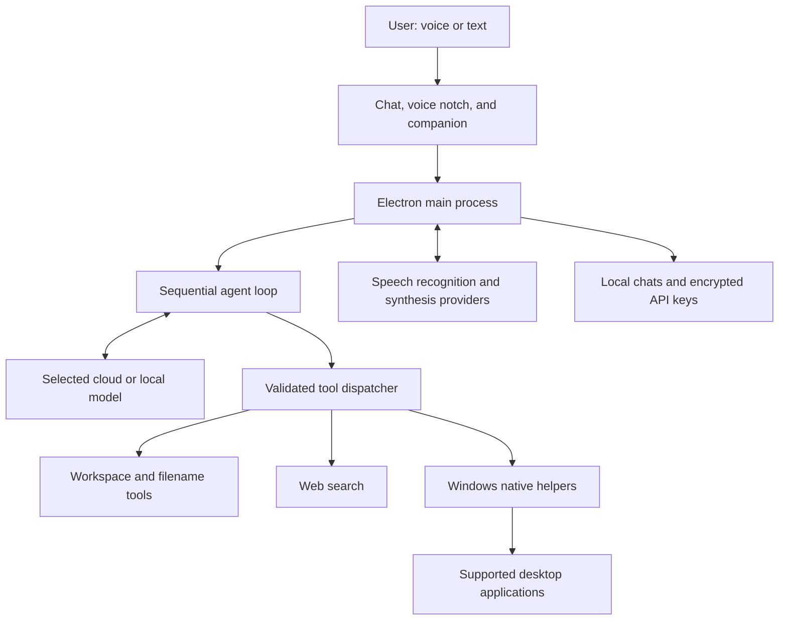

# Aurora: A Voice-First Windows Agent Companion

**Heartflow AI · Project Whitepaper**  
**Document version:** 1.1

**Date:** October 5, 2026

**Implementation baseline:** Aurora 0.2.0, local release preparation
**Status:** Working Windows prototype; not a production security certification or performance benchmark.

## Abstract

Aurora is a Windows AI agent harness that connects a user's chosen model to practical desktop tools through a simple branded interface. Connections support OpenAI, Claude / Anthropic, OpenRouter, Ollama Cloud and local Ollama. An animated character communicates activity, while optional voice recognition and speech output allow the user to request work, answer clarifying questions, and receive short spoken results. A compact top-center notch supports these conversations while the main application is minimized.

The project combines streaming chat, tool execution, filename search, workspace operations, and bounded interaction with supported Windows applications. Its distinctive experience is a visible companion that can leave the conversation interface, appear beside a verified file in Explorer, and show what the agent is doing. Real computer input uses a light-pink animated pointer and a small action display.

Aurora is deliberately narrow in its initial scope. It uses application accessibility information rather than screenshot-based vision. It supports selected desktop applications, requires explicit approval for file writes and PowerShell commands, and depends on the user's cloud accounts. The prototype demonstrates the interaction model and native integration; broader application coverage, stronger execution isolation, distribution, and measured reliability remain future work.

## 1. Product Vision

Most desktop agent workflows begin in a chat window and expose their actions through text logs. Aurora adds a persistent character and a voice conversation layer so the user can understand progress without keeping a large application open.

The intended experience is straightforward:

1. The user enables listening and says “Aurora.”
2. Aurora appears in the notch, greets the user, and listens for a request.
3. She asks for missing details when necessary and waits for an answer.
4. The harness runs the appropriate tools and displays activity.
5. Aurora returns a short spoken result and preserves fuller details in chat.

The goal is minimal interaction after initial setup. API connection, voice selection, workspace configuration, and microphone activation still use application controls. The prototype does not eliminate all mouse and keyboard use.

## 2. Current Capabilities

| Area | Implemented behavior |
| --- | --- |
| Model connection | Separate saved cloud or local connections, model listing, streaming replies and provider-specific tool adapters. |
| Conversation | Saved chats, Markdown rendering, activity feed, task cancellation, and clarifying questions. |
| Modes and projects | Normal and Aurora Code sessions, project grouping, and a remembered workspace folder per project. |
| Session library | Local search across titles and user/assistant message content, cross-project results, and confirmed session deletion. |
| Workspace | Directory listing, UTF-8 text reads, and approval-gated file creation or replacement. |
| Commands | Approval-gated Windows PowerShell execution with a timeout and cancellation. |
| Web information | Ollama-backed web search with returned source URLs. |
| File discovery | Bounded filename search in configured folders without requiring a selected workspace. |
| File presentation | Explorer selection, Aurora's pointing pose, and a changing-color border beside a verified visible row. |
| Voice | Optional ElevenLabs or Fish Audio recognition and speech output, with a Windows recognition fallback. |
| Minimized interface | Animated voice notch, recognized words, replies, option cards, and task controls. |
| Computer interaction | Application discovery, minimized-window restoration, focus, navigation, and real mouse/keyboard input through observed controls. |
| Character | Shared activity poses in the application and desktop companion, timed reactions, and teleport movement. |

Supported application targets currently include Opera, Chrome, Edge, Brave, Firefox, Explorer, Notepad, and Calculator. Support means the harness can launch or discover these applications and attempt interaction with exposed controls; it does not imply complete coverage of every page, dialog, extension, or application version.

## 3. Architecture

Aurora uses Electron for the Windows application shell, Node.js for orchestration and provider communication, and native Windows helpers implemented with C# and PowerShell. The interface uses HTML, CSS, and JavaScript without a separate frontend framework.

### 3.1 Agent Loop

A request enters a sequential loop in the main process. The selected model receives instructions, conversation history, available tool definitions, and previous tool results. Streaming text appears in the interface as it arrives.

When the model requests a tool, the harness validates its name and arguments, applies the relevant approval or interaction checks, executes the action, and returns the result to the model. The loop continues until the model finishes, the user stops the task, a failure ends the request, or the 40-model-turn limit is reached.

This separation matters: the language model proposes actions, while the application decides whether and how each tool can execute. A model reply alone is not evidence that an action succeeded.

### 3.2 Windows Observation and Input

Computer interaction uses Windows UI Automation and a legacy Microsoft Active Accessibility fallback. Observations include window identifiers, process names, visible control labels, control identifiers, and relevant editable values. Browser observations are bounded before being returned to the model.

Window discovery includes minimized windows. Opening a supported application first attempts to restore and reuse an existing window. Focus activation is retried and verified before input. Browser navigation can use the address bar directly with an HTTP or HTTPS URL, even when an address-bar accessibility control is unavailable.

Clicks, typing, scrolling, and pointer movement use observed controls rather than model-invented screen coordinates. Control identifiers expire after input, and the model must observe again. The helper checks foreground identity, target visibility, and interference before acting. Elevated windows cannot be reliably controlled through this input path.

The current implementation does not send screenshots to the model. Unlabeled custom interfaces and inaccessible page controls can therefore prevent completion.

### 3.3 Presentation Layer

The main chat, notch, desktop companion, file border, and action display are separate presentation surfaces. Overlay behavior is coordinated to avoid displaying two Auroras during a file presentation.

When Aurora shows a verified file, the notch hides and the desktop companion appears beside its Explorer row. After presentation ends, the temporary companion disappears and the notch returns if the conversation remains active. During computer interaction, the notch hides to avoid covering browser controls.

Overlays reassert their position above normal application windows without taking keyboard focus. Windows secure desktop and exclusive fullscreen behavior can take precedence. Software rendering is used to improve recording compatibility; universal screen-recorder compatibility is not established.

## 4. Voice Interaction

Listening begins disabled each time the application opens. The user explicitly enables it after configuring recognition and speech output.

In cloud recognition mode, locally detected speech is sent to the selected recognition provider. Wake-word detection is based on recognition of “Aurora”; the prototype does not use a separate dedicated local wake-word engine. Detected speech used for wake detection can consume provider credits. Silence is filtered locally rather than continuously uploaded.

A completed utterance is submitted after approximately 950 milliseconds of quiet. Recording also has audio-duration and wall-clock limits. A manual finish control is available. Partial recognition text is displayed but does not execute tasks or approve actions.

Aurora can maintain a conversation after waking, ask a follow-up question, and continue the pending task after an answer. Clarifications appear inline in chat without a blocking overlay or automatic keyboard focus. Choices appear as numbered buttons with a reply field and task cancellation; minimized voice questions remain in the notch. The spoken prompt remains brief: “Which one did you have in mind?” The user can answer with a number or a matching name. Ambiguous answers keep the question open.

Input pauses during Aurora's speech to reduce recognition of her own output. The current version does not provide voice interruption of speech playback. Recognition quality depends on the selected provider, language, microphone, room conditions, and account access.

Spoken replies can include separate, validated emotion metadata. Fish receives model-appropriate delivery tags while chat and notch text remain plain. Greetings, clarifications and approvals use restrained context defaults. Emotion is included in the speech cache key. After requested music playback is marked complete and a fresh browser Pause control is present, a minimized voice conversation can deliver a short sign-off and return to wake-word mode. This is an accessibility-and-model check, not independent audio verification.

## 5. Character and Motion

Aurora's identity uses the supplied pixel-art character, with matching activity assets and a pink, purple, white, and gold visual palette. States include idle, thinking, coding, browsing, approval, success, error, walking, and teleporting.

A Heartflow application icon derived from the supplied neon-heart logo is embedded in Windows builds. The original, generated master and generation prompt are preserved with the source. Existing character poses briefly accompany speech emotions and restore after completion or a short limit.

These are sprite animations and presentation effects rather than a skeletal character rig or a learned emotion system. Activity states communicate harness progress; they should not be interpreted as a claim of consciousness or emotional understanding.

Automatic desktop travel uses a brief fade-out, one relocation, and fade-in. The walking cycle remains available in the animation gallery. Success reactions last approximately 1.8 seconds before returning to idle.

During computer input, a light-pink rounded triangle without a tail replaces the normal cursor temporarily. The 32-by-32-pixel transparent canvas contains approximately 24-pixel visible artwork. Movement follows short curved paths with smooth acceleration and deceleration. A separate helper restores the previous cursor shapes after inactivity, stop, shutdown, or loss of the parent process.

## 6. Privacy and Execution Boundaries

Aurora combines local execution with cloud processing. It is not an entirely offline product.

| Data | Handling in the prototype |
| --- | --- |
| API keys | Stored through Electron safeStorage using Windows DPAPI; saved keys are not returned to renderers. |
| Chats and transcripts | Stored locally; conversation context is sent to Ollama when needed for model requests. |
| Tool outputs | Sent to the model, including file contents read through tools and observed application labels. |
| File search | Sends matching filenames, paths, sizes, and modification times as tool results; search itself does not read file contents. |
| Microphone audio | Cloud mode sends detected speech to the selected provider. The application does not write microphone recordings to disk. Windows fallback uses local recognition. |
| Spoken replies | Text is sent to the selected speech provider for synthesis. |
| Local history | Chats and ordinary local file outputs are plain text. |

DPAPI protection is useful against other Windows users reading saved keys. It does not protect the application from malicious software running as the same Windows user.

Direct workspace file tools reject paths escaping the selected workspace, including junction or symlink escapes. File writes require approval and replace the entire file. Every model-requested PowerShell invocation requires approval, but PowerShell is not sandboxed and runs with the Windows user's access.

Computer tools restrict application targets and validate observed controls. The agent instructions require confirmation before purchases, message submissions, deletion, or account/security changes. These model instructions are not an operating-system sandbox or a universal technical enforcement mechanism for every consequence of a click.

Task stopping is available through application controls, voice commands, Ctrl+Alt+Escape, and the pointer safety corner. Cancellation does not roll back completed actions.

Web results, filenames, file contents, and screen labels are treated as untrusted information in the agent instructions. Prompt-injection resistance has not been independently audited.

## 7. Latency and Provider Usage

Aurora separates brief spoken output from fuller written details through a dedicated voice-reply tool. The model is instructed to keep speech to one or two natural sentences, usually under 35 words, while retaining important decisions and errors.

Fish speech playback can begin while raw PCM chunks are still arriving. Short repeated speech outputs are cached in memory, with a bounded cache that is cleared when voice settings change. Numbered choices, long paths, code, and detailed option lists remain visual rather than being read aloud.

Browser restoration and navigation can execute through one tool call. Input actions return fresh observations to avoid separate model-directed screen reads. When computer control is enabled, native helpers prepare in the background without taking control of input. Navigation uses bounded local readiness polling.

These measures can reduce repeated synthesis and perceived waiting. No paid-provider latency benchmark, measured percentage saving, or guaranteed monthly cost is claimed. Cloud recognition, model use, search, and speech output remain subject to the user's provider access and billing arrangements. A provider subscription does not establish that every API endpoint is enabled or funded.

## 8. Validation and Evidence

The v18 development checks passed 57 automated tests and JavaScript syntax validation. Tests cover tool validation, path boundaries, cancellation, provider stream handling, recording completion, scoped voice approvals, voice choices, bounded browser observations, legacy-session migration, project workspaces, content search, and deletion. An isolated library integration check exercises mode-specific prompts, project creation, moving sessions, search, deletion confirmation, persistence, and compact window layout.

Integration checks use isolated settings and simulated cloud responses to exercise actual Electron windows, audio playback, clarification, approvals, notch visibility, file handoff, and cursor restoration. These do not establish real-world speech accuracy or paid-provider availability.

The Opera integration check used a separate private window in the installed browser. It verified discovery while minimized, restoration and focus, navigation, page-control observation, a real button click, and silent audio playback on a local test page. A public YouTube check verified readable search or consent controls. It did not verify live music playback in the user's account.

These results demonstrate specific behaviors under controlled conditions. They are not a benchmark against competing agents, an assurance of arbitrary desktop task completion, or an independent security assessment.

## 9. Current Limitations

- Application coverage is bounded, and accessibility quality varies between pages and applications.
- The model can choose an incorrect action or misinterpret a result; provider and model choice affect reliability.
- Screenshot vision, arbitrary desktop-icon recognition, and general unrestricted coordinate interaction are not implemented.
- Filename searches cover configured folders and report traversal limits rather than automatically scanning every drive.
- File replacement has no built-in diff review, undo, or task rollback.
- Long conversations have no automatic context compaction and can exceed a model's context limit.
- Speech recognition and cloud API permissions require verification with the user's microphone and accounts.
- Overlay recording compatibility is not verified for every recorder or fullscreen mode.
- Windows builds are unsigned. The installer and GitHub Release updater are implemented, but a live installed-version upgrade needs published assets and separate validation. New provider adapters are tested with fixtures; account-specific access and model reliability need live validation.

## 10. Proposed Roadmap

The following items are proposals, not delivered features or dated commitments.

**Reliability:** Expand reproducible browser and application fixtures, measure task completion rates, improve recovery from focus changes, and provide clearer failure reporting.

**Voice:** Evaluate a dedicated local wake-word engine, measure transcription error rates and response latency, add optional speech interruption, and expose understandable usage controls.

**Execution controls:** Add stronger policy enforcement for consequential actions, scoped permissions, file diffs, action previews, recovery options, and independent prompt-injection testing.

**Observation:** Evaluate optional visual observation for inaccessible interfaces, with explicit data handling and bounded execution policies before expanding desktop coverage.

**Distribution:** Validate installed upgrades and signed releases, maintain dependencies, and add support diagnostics that avoid collecting secrets. Version 0.2.0 adds an installer, explicit download/restart controls and versioned release notes; source pushes alone do not publish updates.

**Experience:** Refine character transitions, accessibility and reduced-motion behavior, and voice-first onboarding while maintaining one coherent Aurora across surfaces.

## 11. Project Scope and Ownership

Heartflow AI is the project's brand, and Aurora is its companion character and agent identity. The initial implementation uses user-provided cloud credentials rather than a shared project-owned inference account. This document does not define a commercial price, subscription, token, financial instrument, or licensing program.

Source code, native helpers, tests, documentation, and character assets form the development project. Packaged applications, dependency folders, temporary test profiles, recordings, and API credentials are excluded from the source repository. Character-asset provenance and redistribution rights should be resolved before public distribution; this document does not establish those rights or grant a license.

## 12. Implementation References

The original desktop and voice checks apply to the v18 baseline. Version 0.2.0 additionally has provider/update unit fixtures and Electron settings checks covering migration, encrypted credentials and colour palettes across the main app, notch and desktop pet. These checks do not establish live provider-account access or published update success. These files provide a direct path from the product description to the code:

- [README.md](README.md): setup, supported workflows, testing, and limitations.
- [src/main.js](src/main.js): orchestration, approvals, local persistence, and interface coordination.
- [src/provider.js](src/provider.js) and [src/provider-adapters.js](src/provider-adapters.js): provider streaming requests, tool conversion and search.
- [src/app-updates.js](src/app-updates.js): installed release checks and explicit update actions.
- [src/appearances.js](src/appearances.js): colour palette registry reusing existing animation artwork.
- [src/tools.js](src/tools.js): tool definitions, validation, and execution.
- [src/computer-control.js](src/computer-control.js): application reuse and bounded browser observations.
- [src/native/desktop-control.cs](src/native/desktop-control.cs) and [src/native/legacy-accessibility.cs](src/native/legacy-accessibility.cs): Windows observation and input.
- [src/voice-session.js](src/voice-session.js): voice conversation lifecycle.
- [src/voice-notch.js](src/voice-notch.js): minimized conversation surface and visibility.
- [src/file-presentation.js](src/file-presentation.js): verified file presentation.
- [scripts/opera-smoke.js](scripts/opera-smoke.js) and [scripts/notch-smoke.js](scripts/notch-smoke.js): browser and notch integration checks.
